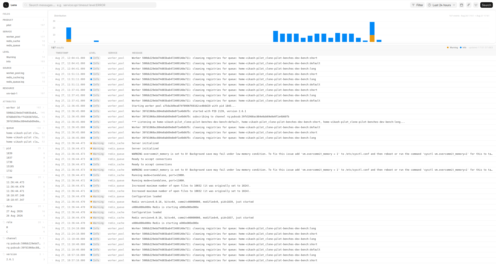
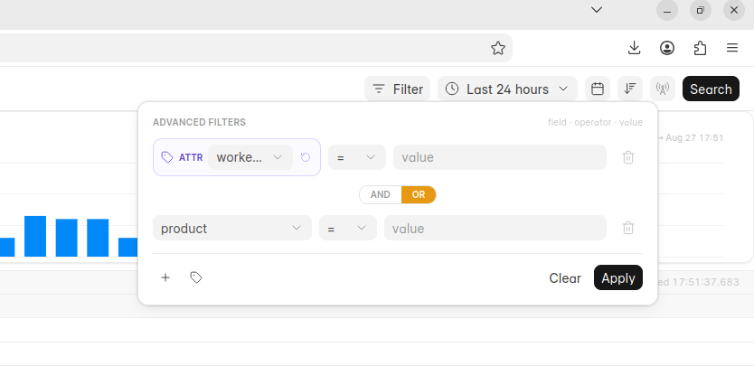
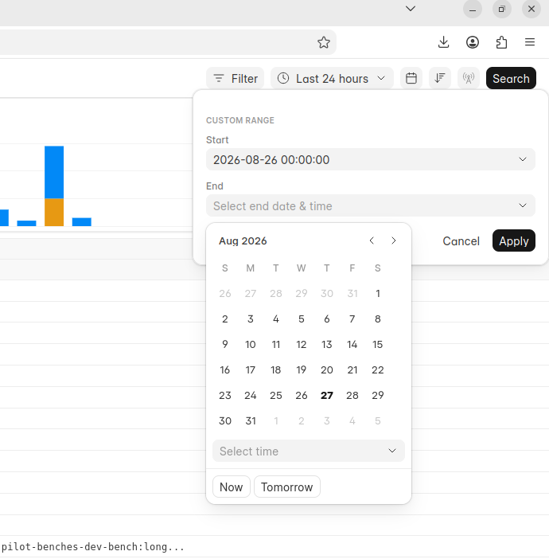

### Lens

A log viewer for the Frappe fleet. Reads logs stored in ClickHouse (via the Datum telemetry service) and presents them in a searchable, filterable UI built with frappe-ui.

### Screenshots





### Dependencies

**Frappe Insights** is a required dependency. Lens does not manage its own ClickHouse connection — it reads the ClickHouse credentials (host, port, database, username, password) from the **Insights Data Source v3** doctype that Insights creates. Lens queries the `logs` and `daily_log_stats` tables in the same ClickHouse instance that Datum writes to, using whatever data source is configured there.

This means:
- **No separate ClickHouse configuration** — Lens reuses the connection Insights already manages.
- **Insights must be installed** on the same bench site, with a ClickHouse data source set up.
- The ClickHouse database must be the one Datum writes to (`datum` by default), with the `logs` table created by Datum's migrations.

### Installation

You can install this app using the [bench](https://github.com/frappe/bench) CLI:

```bash
cd $PATH_TO_YOUR_BENCH
bench get-app https://github.com/20vikash/Lens.git --branch develop
bench install-app lens
```

### Setup

1. Ensure [Frappe Insights](https://github.com/frappe/insights) is installed and set up on the same site.
2. Create a ClickHouse data source in the **Insights Data Source v3** doctype (database type: ClickHouse), pointing at the Datum ClickHouse instance.
3. Ensure Datum's migrations have been run so the `logs` and `daily_log_stats` tables exist.
4. Visit `/logs` to open the viewer.

### Frontend development

```bash
cd apps/lens/frontend
yarn install
yarn dev    # dev server on :8085, proxies to bench
yarn build  # builds to lens/public/frontend/ and copies index.html to www/logs.html
```

### Contributing

This app uses `pre-commit` for code formatting and linting. Please [install pre-commit](https://pre-commit.com/#installation) and enable it for this repository:

```bash
cd apps/lens
pre-commit install
```

Pre-commit is configured to use the following tools for checking and formatting your code:

- ruff
- eslint
- prettier
- pyupgrade

### License

mit
